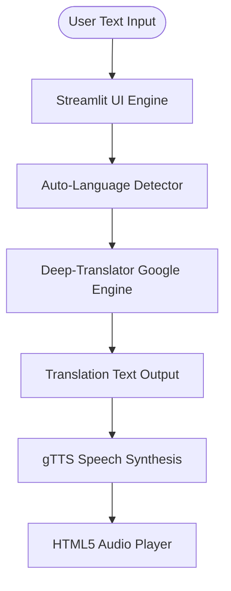

# Project Report: Multilingual Language Translation Tool

---

## 1. Project Overview & Abstract

In today's globalized world, breaking language barriers is critical for seamless communication, commerce, and knowledge sharing. The **Multilingual Language Translation Tool** is a web-based, production-ready application designed to provide instantaneous translation of textual content. 

The application utilizes an advanced, automated language detection mechanism to detect the input language, translates it into the user's selected target language from a list of over 100+ choices, and synthesizes the translated output into spoken audio. This ensures both visual and acoustic accessibility.

---

## 2. System Architecture & Modules

The application follows a modular, client-server design using a web browser interface served by a local or cloud Streamlit server.

### Module Breakdown:
1. **User Interface Module (`streamlit`)**: Responsible for layout rendering, color styling (CSS injection), language selectors, text inputs, and results presentation.
2. **Translation Engine (`deep-translator`)**: Sends requests to Google's translation backend using secure HTTP calls. Translates chunks of text reliably and efficiently.
3. **Speech Synthesis Module (`gTTS`)**: Converts text characters into natural-sounding speech (MP3 format) using Google Text-to-Speech API.

---

## 3. GitHub Repository Description

**Repository Title**: `multilingual-translation-tool-streamlit`

**Description**:
> 🌐 A responsive, production-ready Language Translation web application built in Python using Streamlit, Deep Translator, and gTTS. Features automated source language detection, support for 100+ target languages, built-in clipboard copying, and instant text-to-speech audio synthesis. Complete with clean custom styling, detailed documentation, and setup guides.

---

## 4. LinkedIn Project Description

**Title**: Created a Multilingual Translation & Speech Synthesis Web App with Python & Streamlit

**Post Description**:
> 🚀 I am thrilled to share the completion of my first internship project as an AI Intern at CodeAlpha: a **Multilingual Language Translation Tool**! 🌐
> 
> Language barriers can hinder global interaction, so I built a responsive web app to translate text into over 100 languages instantly.
> 
> **Key Features**:
> 🔍 **Auto-Language Detection**: Detects input language automatically.
> 🔄 **100+ Language Support**: Translates smoothly between worldwide languages using deep-translator.
> 🔊 **Text-to-Speech (TTS)**: Uses Google TTS (`gTTS`) to synthesize high-quality audio files of the translation.
> 🎨 **Premium Glassmorphic UI**: Customized Streamlit with raw CSS for modern font styling, hover transitions, and dark themes.
> 
> Check out the GitHub repository to run it locally or try it out!
> 
> #Python #AI #Streamlit #MachineLearning #WebDevelopment #Internship #CodeAlpha

---

## 5. Resume Bullet Points

* **AI Intern | CodeAlpha**
  * Engineered a production-quality Multilingual Translation Web Application in Python and Streamlit, serving translation services across 100+ target languages with integrated gTTS audio synthesis.
  * Implemented an automated source language detection pipeline using deep-translator, reducing user selection friction and enhancing UX.
  * Designed a modern, glassmorphic UI using custom CSS injection, achieving high responsiveness and an engaging, professional interface.

---

## 6. Viva Questions and Answers

### Q1: Why did you choose Streamlit over other web frameworks like Flask or Django for this project?
**A**: Streamlit allows rapid prototyping and development of data-focused interfaces using pure Python. It handles application state, reactivity, and basic styling automatically, allowing developers to focus on core logic (NLP/Translation) without writing extensive HTML/CSS/JavaScript boilerplate.

### Q2: What is the benefit of using `deep-translator` over `googletrans` in Python?
**A**: `googletrans` is a popular wrapper around the unofficial Google Translate API, but it frequently breaks due to API changes and returns token errors (`AttributeError: 'NoneType' object has no attribute 'group'`). `deep-translator` is a modern, actively maintained library that interfaces with Google Translate and other translation providers using stable, robust HTTP clients, ensuring reliable translations.

### Q3: How does gTTS (Google Text-to-Speech) work?
**A**: gTTS is a Python library and CLI tool that interfaces with Google Translate's text-to-speech API. It takes text, converts it into an audio stream, and saves it as an MP3 file (or writes to a buffer/file-like object like `BytesIO`).

### Q4: How did you implement the "Auto Detect" language feature?
**A**: The translation engine (via Google Translator) uses Google's built-in language identification algorithms. When the source language is set to `'auto'`, Google's translation backend analyzes the characters and syntax of the text to determine the language before translating.

### Q5: How do you handle cases where gTTS does not support a specific target language code?
**A**: In `app.py`, the gTTS invocation is wrapped in a `try-except` block. If an unsupported or invalid language code is passed (e.g. some regional dialects), gTTS throws an exception. We catch this exception gracefully and display a warning toast or message ("Text-to-speech is not supported for this language code") instead of crashing the app.
